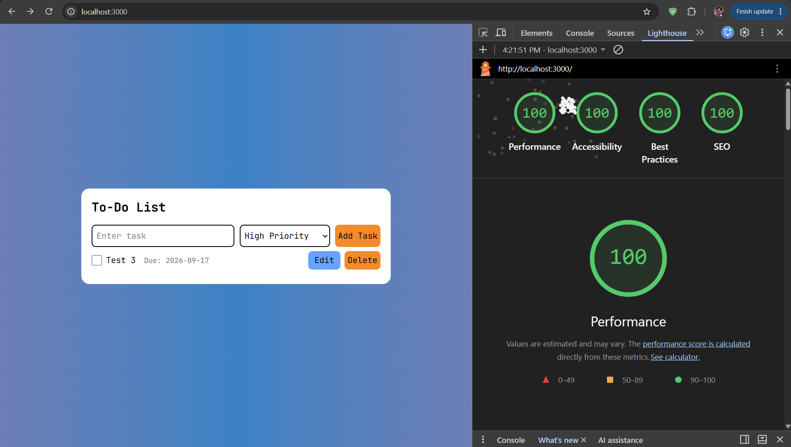

## Getter Done - https://a3-thomas-gilbert.onrender.com

For this project, I added to my todo app from the last assignment. My todo list app supports adding, 
deleting, toggling, and editing functionality. To use this app is very straight-forward. First the 
user must log in. If the user does not have an account one will be created for them automatically.
After logging in, the user can type a task into the text box field and click add new task 
(or hit the enter key) and it will add it to that user's list of tasks. You can check a task off when 
you complete it and delete a task if you no longer need to do it. You can also edit a tasks text and 
priority. The biggest challenge of this assignment was definitely the user accounts and authentication
workflow. I decided to use the basic session-based authentication for this project simply because it
seemed like it would be the easiest to implement. All passwords are hashed with bcrypt before being 
stored in the users collection. For my CSS framework I chose tailwind because it is very common in the 
CS industry right now and I wanted to learn how to use it (it is very easy). For this assignment I
went through my CSS file from last assignment and converted it all to tailwind and then continued to
use tailwind throughout the rest of the project. Overall this was a fun, but challenging project.

## Technical Achievements
- **Tech Achievement 1**: I got 100% in all four lighthouse tests required for this assignment. (+5 pts)

### Design/Evaluation Achievements
- **Unfortunately I did not do any Design/UX achievements for this assignment :( 
